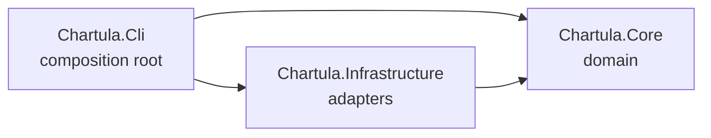
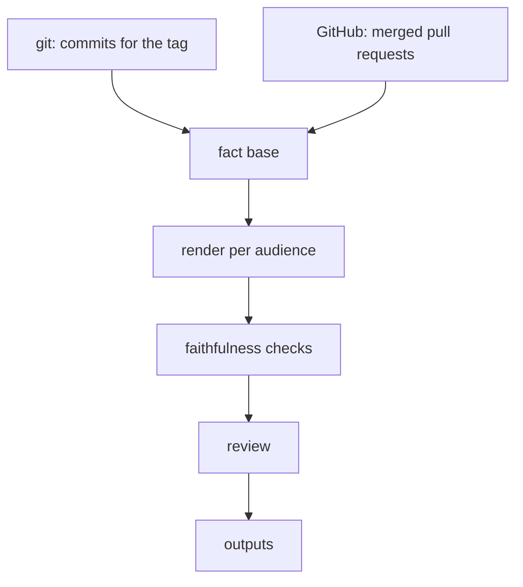

# Architecture

Chartula is three projects, and the dependencies only ever point inward.

| Project | What lives there |
| --- | --- |
| `Chartula.Core` | The domain: the pipeline, the rules, and the ports it needs. No I/O. |
| `Chartula.Infrastructure` | The adapters behind those ports: git, the GitHub API, the file system. |
| `Chartula.Cli` | The command surface and the composition root that wires the two together. |

`Chartula.Core` references no project at all, and that is the rule worth protecting.
It is why the pipeline can be tested end to end without a network, a repository, or a model - see [Test fixtures](test-fixtures.md).

Where a decision is made says a lot about it.
Which model provider is used, which token is read, where files land: all of that is decided in `Chartula.Cli`, in one `Add*` extension per seam, and nowhere else.

## The pipeline

**Facts are established, then rephrased.** The fact base is built deterministically: changes are resolved, filtered, categorized and labelled by rules, with no model involved.
Only then does an LLM turn those facts into prose, once per audience.

That order is the whole design.
The model never decides what happened, so it cannot invent a change; it can only phrase one badly, which the checks are there to catch.

**One fact base, every audience.** The technical, customer and product texts are rendered from the same `FactBase`, so they cannot contradict each other.

**Two checks, different costs.** The rule-based check is pure and free and always runs.
The thorough check is a second model pass and can be turned off.
Whether it earns its tokens is a question the run itself answers - see [Run metrics](run-metrics.md).

**Preview and generate are the same run.** They differ in the last step only: preview writes nothing.

## Choices that constrain contributions

A native-AOT build is a goal, and several dependencies were picked to keep it reachable.
Please do not trade these away without raising it first:

- **The git CLI, not LibGit2Sharp.** A native library would work against a self-contained, trim-friendly binary.
- **`HttpClient` and source-generated JSON, not Octokit.** The GitHub surface Chartula needs is small, and reflection-based serialization is what trimming struggles with most.
- **Source-generated regexes**, for the same reason.
- **`Microsoft.Extensions.AI.IChatClient`, not a provider SDK, in the domain.** The provider package is referenced by `Chartula.Cli` alone, which is what makes the domain untestable against a real model by construction rather than by discipline.

## Where things are

| Concern | Where |
| --- | --- |
| Reading commits and pull requests | `Core/History`, `Core/PullRequests` (ports), `Infrastructure` (adapters) |
| Deciding what counts as a change | `Core/Curation`, `Core/Filtering`, `Core/Labeling`, `Core/Categorization` |
| The grounded facts | `Core/Facts` |
| Turning facts into prose | `Core/Generation`, `Core/Rendering`, `Core/Prompting`, `Core/Llm` |
| Prompt text | `Core/Prompting/ChangelogPromptBuilder.Prompts.cs` - text only, kept apart from the logic so prompts are easy to find and change |
| Checking the prose | `Core/Faithfulness`, `Core/Review` |
| Writing the outputs | `Core/Serialization`, `Core/Releases` (ports), `Infrastructure` (adapters) |
| Measuring a run | `Core/Observability` |
| Wiring it all up | `Cli/Composition` |
