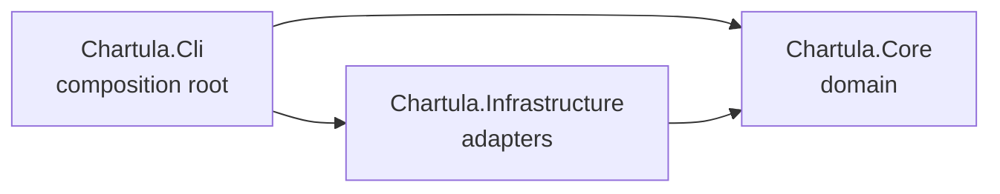
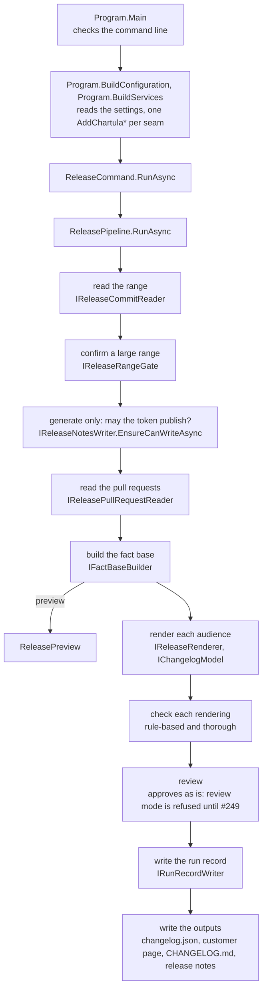

# Architecture

This page shows where the code for each concern lives and how a run moves through it.
What Chartula does for a user is described in the [user documentation](../../README.md#documentation); this page describes the code that does it.

## Projects and the dependency rule

Chartula is three projects, and the dependencies only ever point inward.

| Project | What lives there |
| --- | --- |
| `Chartula.Core` | The domain: the pipeline, the rules, and the ports it needs. No I/O. |
| `Chartula.Infrastructure` | The adapters behind those ports: git, the GitHub API, the file system. |
| `Chartula.Cli` | The command surface, the configuration, and the composition root that wires the two together. |

`Chartula.Core` references no project and one package, `Microsoft.Extensions.AI`.
That is why the pipeline can be tested end to end without a network, a repository or a model ([Testing](testing.md)).

Where a decision is made says a lot about it.
Which model provider is used, which token is read, where files land: all of that is decided in `Chartula.Cli`, in one `AddChartula*` extension per seam, and nowhere else.

## A run in code

1. **`Program.Main`** (`Cli/Program.cs`) checks the command line with `CommandLineArguments.Check` before anything else runs, and hands `doctor` to `DoctorCommand`.
2. **`Program.BuildConfiguration`** reads the settings (`ChartulaConfiguration.Build`: `chartula.yaml`, then the environment), and **`Program.BuildServices`** calls one `AddChartula*` extension per seam in `Cli/Composition`.
   Each extension checks its settings while it builds, so a setting that cannot work stops the run here, as `Configuration error:`.
3. **`ReleaseTarget`** resolves the tag and the repository, or says which option to pass, and `EndpointNotice` and `GitHubTokenNotice` print the header.
4. **`ReleaseCommand.RunAsync`** (`Cli/Commands`) runs the pipeline and prints its outcome, or the error it stopped with.
5. **`ReleasePipeline`** (`Core/Pipeline/ReleasePipeline.cs`) is the whole run in one file:
   - It reads the range through `IReleaseCommitReader` (`GitCliCommitReader`) and confirms a large one through `IReleaseRangeGate` (`ConsoleRangeGate`).
   - In `generate`, it asks `IReleaseNotesWriter` whether the token may publish, before anything costs money.
   - It reads one GitHub request per commit through `IReleasePullRequestReader` (`GitHubPullRequestReader`).
   - `IFactBaseBuilder` (`FactBaseBuilder`) curates, filters, labels and categorizes the changes into the `FactBase`. A preview returns here, with a `ReleasePreview`.
   - `IReleaseRenderer` renders each audience: `ReleaseChangelogGenerator` plans the rendering (`GroundedFactsFactory`), asks the model through `IChangelogModel` (`ChatModel`), composes the answer into the plan (`RenderingComposer`) and normalizes it (`ChangelogFormatter`).
   - It runs both checks on each rendering and hands the result to `IReviewCoordinator`, which approves it as it is while review mode is off; review mode is refused at composition.
   - It writes the run record, then the outputs through `IChangelogJsonWriter`, `ICustomerPageWriter`, `IChangelogMarkdownWriter` and, in `generate`, `IReleaseNotesWriter`.

The ports are in `Chartula.Core`; the adapters for git, GitHub and files are in `Chartula.Infrastructure`, and those for the terminal (`ConsoleRangeGate`, `ConsoleRunProgress`) in `Cli/Commands`.

## Principles

Each one is a recorded decision; its record says why, and what it costs.

- **Facts are established first, then rephrased:** what a release contains is decided by code, and the model only words it ([ADR 0001](adr/0001-facts-first-then-rephrase.md)).
- **The structure of a rendering is the code's:** groups, order, markers and references are planned before the model is called, and an answer that does not map onto the plan fails ([ADR 0001](adr/0001-facts-first-then-rephrase.md)).
- **One fact base for every audience:** each rendering starts from the same changes, categories and breaking status, which does not keep two texts from wording a change differently ([ADR 0001](adr/0001-facts-first-then-rephrase.md)).
- **No dependency that blocks a native-AOT build:** the git CLI, `HttpClient` with source-generated JSON, and source-generated regexes ([ADR 0002](adr/0002-dependencies-that-keep-native-aot-reachable.md)).
- **Endpoints and credential names come from the environment only,** never from a file a pull request can change ([ADR 0003](adr/0003-endpoints-and-credentials-from-the-environment.md)).
- **The domain talks to models through `IChatClient` alone,** and the provider packages are referenced by `Chartula.Cli` ([ADR 0004](adr/0004-models-through-ichatclient-alone.md)).
- **Refuse rather than guess what the user meant,** before anything is spent, with the cause and the fix ([ADR 0005](adr/0005-refuse-rather-than-guess.md)).

A change that goes against one of them starts as an issue; the [ADR index](adr/README.md) says how a new decision is recorded.

## How the two checks work

`ReleasePipeline.CollectFlagsAsync` runs both on each rendering, with its customer description included, and records what each found in `IRunMetrics`.
Neither changes the text; their flags reach the report (`ReleaseCommand`) and the run record.

**The rule-based check** (`Core/Faithfulness/RuleBasedFaithfulnessChecker.cs`) makes no model call.
It joins the tag, the titles and the descriptions into one lowercase text, then flags every number of the rendering that is neither in that text nor a pull request or issue number of the release, and every name in backticks or double quotes the text does not contain.
It compares both with every run of whitespace folded into one space and code fences taken out, because a rendering is one line per entry while a description keeps its line breaks and fenced blocks ([#315](https://github.com/goldbarth/chartula/issues/315)).
A number written with thousands separators is read as one number and compared without them, so `8,000` backs `8000` and backs neither `8` nor `000` ([#350](https://github.com/goldbarth/chartula/issues/350)).

**The thorough check** (`Core/Faithfulness/ThoroughFaithfulnessChecker.cs`) sends the facts, each opening on its pull request number such as `[#12]`, and the rendering to `IChangelogModel.CheckFaithfulnessAsync`.
The model answers in a fixed shape: each unsupported claim with its quote, its reason and the pull request it concerns.
The checker keeps a pull request number only when the release has that pull request, and `ThoroughCheckModel` (`Cli/Composition`) lets the check run on another model than the rendering.

Every model answer, a rendering's or a verdict's, passes `CallValidity` (`Core/Llm`) before it is read: the whole prompt reached the model, the answer has the requested shape, and a verdict is consistent.
A rendering that fails is an error of its audience.
A verdict that fails leaves the rendering in place, flagged as not evaluated, because an empty list of claims would read as a clean check.

## Where user-facing messages are written

A message is written where its cause is known, and it names the cause and the fix ([ADR 0005](adr/0005-refuse-rather-than-guess.md)).
So a git problem is described in the git adapter, not in the CLI that prints it.

| What the user sees | Where it is written |
| --- | --- |
| The help text, and an unknown command or option | `Cli/Program.cs` (`PrintUsage`), `Cli/Commands/CommandLineArguments.cs` |
| `Configuration error:` | `Cli/Configuration` (`ChartulaYamlReader`, `ChartulaYamlSchema`, `EndpointUrl`, `ProviderHost`, the options parsers) and the `AddChartula*` extensions in `Cli/Composition`; `Program` adds the prefix |
| The announced `--tag` and `--repo` defaults | `Cli/Commands/ReleaseTarget.cs` |
| The run header and the missing token warning | `Cli/Commands/EndpointNotice.cs`, `Cli/Commands/GitHubTokenNotice.cs` |
| The `Range:` line and its question | `Cli/Commands/ConsoleRangeGate.cs` |
| The progress lines | `Cli/Commands/ConsoleRunProgress.cs`, with the spinner and what a stream may show in `Cli/Terminal` (`QuietPulse`, `TerminalProfile`) |
| The report: renderings, flags, written files, `Error:` and `Stopped:` | `Cli/Commands/ReleaseCommand.cs` |
| The `preview` report | `Cli/Commands/ReleaseCommand.cs`, from `Core/Pipeline/ReleasePreview.cs` |
| The run summary | `Core/Observability/RunReportFormatter.cs` |
| The `doctor` report | `Cli/Commands/DoctorCommand.cs` |
| No tag or no repository to default to | `Cli/Commands/ReleaseTarget.cs` |
| A git failure: a tag that does not resolve, a shallow clone, a `--since` that is no ancestor | `Infrastructure/History` (`GitCliCommitReader`, `GitCliRepositoryReader`) |
| A GitHub failure: access, permissions, rate limit | `Infrastructure/GitHub/GitHubErrorResponse.cs`, used by the pull request reader and the release notes writer |
| A failed model call | `Cli/Composition/FailureDescribingChatClient.cs` and `ModelErrorResponse.cs` |
| A cut-off prompt or answer, an unreadable verdict | `Core/Llm/CallValidity.cs` |
| An answer that does not match the facts | `Core/Generation/RenderingComposer.cs` (`FindMismatch`) |

[Troubleshooting](../troubleshooting.md) shows the common ones as a user meets them; a change to a message there changes that page too.

## Where things are

| Concern | Where |
| --- | --- |
| The command line and the commands | `Cli/Program.cs`, `Cli/Commands` |
| Reading the configuration | `Cli/Configuration`: `ChartulaConfiguration` (file, then environment), `ChartulaYamlReader` and `ChartulaYamlSchema` (the file and every key), one options type per section |
| Wiring it all up | `Cli/Composition`, one `AddChartula*` extension per seam |
| What a terminal may show: motion, colour, Unicode, `--plain` | `Cli/Terminal` |
| The model providers | `Cli/Composition`: `LlmServiceCollectionExtensions` (builds the `IChatClient`), `OpenAiCompatibleChatClient`, `ClaudeThinkingSupport`, `ThoroughCheckModel`; the transport handlers `ModelRequestCountingHandler` (retries) and `ModelErrorResponseHandler` with `FailureDescribingChatClient` (failure messages) |
| The GitHub client | `Cli/Composition/GitHubHttpClientFactory.cs` |
| The run | `Core/Pipeline`: `ReleasePipeline`, the range rule `LargeRangeRule`, the gate `IReleaseRangeGate` |
| Reading commits and pull requests | `Core/History`, `Core/PullRequests` (ports), `Infrastructure/History`, `Infrastructure/PullRequests` (adapters) |
| Deciding what counts as a change | `Core/Curation` (pull requests or commits, reverts), `Core/Filtering`, `Core/Labeling`, `Core/Categorization` |
| The facts | `Core/Facts`: `ChangeFact`, `FactBase`, `FactBaseBuilder` |
| Planning and composing a rendering | `Core/Generation`: `GroundedFactsFactory`, `RenderingComposer`, `ReleaseChangelogGenerator`; `Core/Rendering` (one call per audience); `Core/Formatting` (Markdown normalization) |
| Prompt text | `Core/Prompting/ChangelogPromptBuilder.Prompts.cs`, text only, kept apart from the logic so prompts are easy to find and change |
| Talking to a model | `Core/Llm`: `IChangelogModel`, `ChatModel`, `CallValidity` |
| Checking the prose | `Core/Faithfulness`, `Core/Review` |
| Writing the outputs | `Core/Serialization` (composers, serializers, ports), `Core/Releases` (port); `Infrastructure/Serialization`, `Infrastructure/Releases` (adapters) |
| Measuring a run and its progress | `Core/Observability` |
| Adding a fact field | [Recipe: adding a field to the fact base](recipes/new-fact-field.md) |
